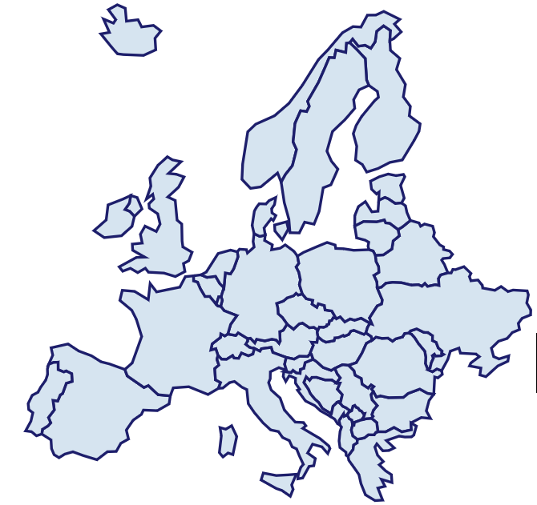

<div align="right"><a target="myNextJob" href="https://www.prisma-capacity.eu/careers#job-offers">
    
</a></div>

# Introduction

PRISMA's Map is a customized European Map in [GeoJSON](https://geojson.org/)-format or [TopoJSON](https://github.com/topojson/topojson) which is an extension of a GeoJSON.

This app is just an example of reading those files and fetching information of the public PRISMA- Api.



# Technology Stack

The example app is written in ReactJS and uses [React-Simple-Map](https://www.react-simple-maps.io/docs/getting-started/) which has under the hood [D3.js](d3js.org).

It should use [Axios](https://github.com/axios/axios)

# Development

Installing deps

```
yarn
```

Start development using Parcel
```
yarn dev
```

It should run on `localhost:1234`.
